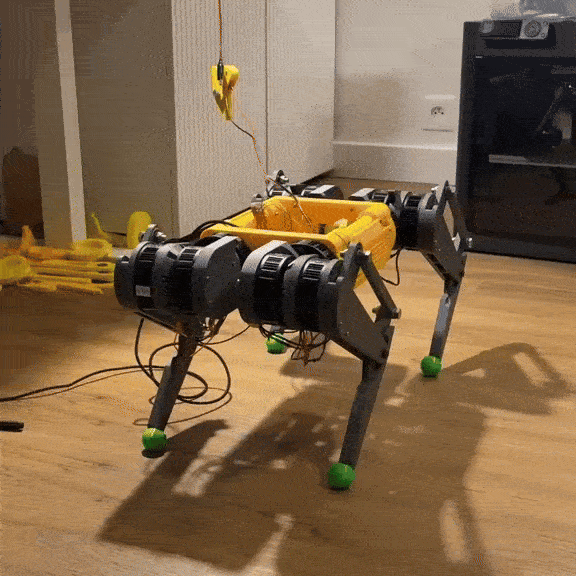

# Quadro
Quadro is the name of my ros2 quadruped project.

## Overview
I'm developing 12 DoF quadruped robot as a part of my master theses as well as my hobby.
The project consists of:
- 3D printed physical physical - fully designed by me. The motors are Steadywin gim6010-8 connected to Raspberry Pi 5 with the use of CAN bus. In the future Nvidia Jetson Orin Nano will be added as a secondary computer for visual SLAM.
- Simulated robot in Isaac Lab.

Right now, only the naive position controller works - robot is able to walk, but only in crawl (one leg up at one time). Model-based predictive controller is in the works.
Controllers, hardware interface and internal communication are based on ROS2 Jazzy libraries. It requires custom **ros_odrive** library with **ros2_control** hardware interface modified to work in my configuration: 
[custom ros_odrive](https://github.com/Rooteq/ros_odrive). That's how the robot looks:

Implementation of the convex model predictive control using this platform is in this repo: [quadruped_mpc_control](https://github.com/Rooteq/quadruped_control/tree/mpc_tests)

## THIS PROJECT IS IN ACTIVE DEVELOPMENT
